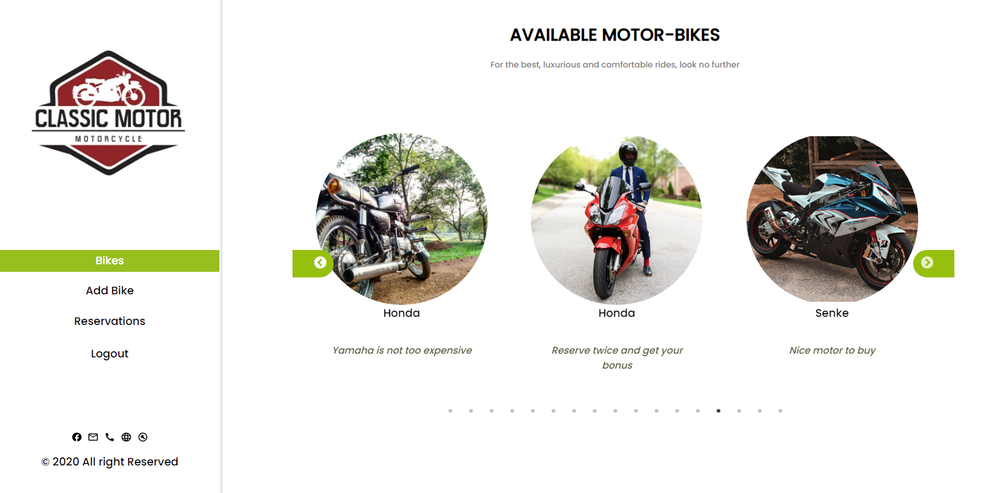

<div id="top" align="center">
  <a href="https://www.microverse.org/">
    
  </a>
  
  <a href="https://github.com/mwafrika/final_capstone_backend">
    
  </a>
  <a href="https://github.com/mwafrika/final_capstone_backend">
    
  </a>
  <a href="https://github.com/mwafrika">
    
  </a>
</div>

<br />

<div id="header" align="center">
  <a href="#">
    
  </a>
  <p align="center">
    <br />
    <a href="https://yamaha-motor.netlify.app/"><strong>Explore the website »</strong></a>
    <br />
    <br />
    <a href="https://github.com/mwafrika/final_capstone_frontend">View Demo</a>
    ·
    <a href="https://github.com/mwafrika/final_capstone_frontend/issues">Report Bug</a>
    ·
    <a href="https://github.com/mwafrika/final_capstone_backend/issues">Request Feature</a>
  </p>
</div>

<!-- TABLE OF CONTENTS -->
<details>
  <summary>TABLE OF CONTENTS</summary>
  <ol>
    <li>
      <a href="#about-the-project">About The Project</a>
      <ul>
        <li><a href="#Sneak peak">Sneak peak</a></li>
        <li><a href="#built-with">Built With</a></li>
      </ul>
    </li>
    <li>
      <a href="#getting-started">Getting Started</a>
      <ul>
        <li><a href="#prerequisites">Prerequisites</a></li>
        <li><a href="#installation">Installation</a></li>
      </ul>
    </li>
    <li><a href="#usage">Usage</a></li>
    <li><a href="#contributing">Contributing</a></li>
    <li><a href="#authors">Authors</a></li>
    <li><a href="#acknowledgments">Acknowledgments</a></li>
    <li><a href="#license">License</a></li>
  </ol>
</details>

<br />

<!-- ABOUT THE PROJECT -->

## About The Project

> **Yamaha Motor App** is a motorcycle reservation platform that allows customers to book their motorcycle remotely within a defined time frame.

### Sneak peak



<p align="right"><a href="#top">⬆️</a></p>

### Built With

<ul style="display: flex; gap: 6px; justify-content: center">


<br></br>
</ul>

<p align="right"><a href="#top">⬆️</a></p>

<!-- GETTING STARTED -->

## Getting Started

_This project depends on this [API backend](https://yamaha-motor.herokuapp.com/api-docs/index.html)_

To get a local copy up and running follow these simple example steps.

### Prerequisites

- Node: v16.13.1
- Javascript enabled browser

### Installation

1. Clone the repo:
   ```sh
   git clone git@github.com:mwafrika/final_capstone_frontend.git
   ```
2. go to the project folder:
   ```sh
   cd final_capstone_frontend
   ```
3. Install the dependencies:
   ```sh
   npm install
   ```
4. Start the server:
   ```sh
   npm start
   ```
5. Enjoy

<p align="right"><a href="#top">⬆️</a></p>

<!-- USAGE EXAMPLES -->

## Usage

_For an easy access to the website please use [this link](https://yamaha-motor.netlify.app/)_

<p align="right"><a href="#top">⬆️</a></p>

<!-- CONTRIBUTING -->

## Contributing

Contributions are what make the open source community such a wonderful place to learn, be inspired, and create. Your contributions are **greatly appreciated**.

Please, take a look at [open issues](https://github.com/mwafrika/final_capstone_frontend/issues) for a full list of proposed features (and known issues).

If you have an idea on how to improve this, please fork the repository and submit a pull request. You may alternatively create a new issue with the tag "improvement."
Don't forget to rate the project! Thank you once again!

1. Fork the Project
2. Create your Feature Branch (`git checkout -b feature/AmazingFeature`)
3. Commit your Changes (`git commit -m 'Add some AmazingFeature'`)
4. Push to the Branch (`git push origin feature/AmazingFeature`)
5. Open a Pull Request

<p align="right"><a href="#top">⬆️</a></p>

<!-- AUTHORS -->

## Authors

👤 **Mwafrika Josué**

- GitHub: [@mwafrika](https://github.com/mwafrika)
- LinkedIn: [@mwafrika-mufungizi](https://linkedin.com/in/mwafrika-mufungizi)
- Twitter: [@mwafrikamufung1](https://twitter.com/mwafrikamufung1)
- Website: [mwafrika.me](https://mwafrika-portfolio-app.herokuapp.com/)

👤 **Bushra Mostafa**

- GitHub: [@bushra](https://github.com/)
- LinkedIn: [bushra](https://www.linkedin.com/in/)
- Twitter: [@bushra](https://twitter.com/)

👤 **Abenezer Tilahun**

- GitHub: [Abenezer Tilahun](https://github.com/)
- Website: [Abenezer Tilahun](https://codingfries.com)
- LinkedIn: [Abenezer Tilahun](https://www.linkedin.com/in/)

<p align="right"><a href="#top">⬆️</a></p>

<!-- ACKNOWLEDGMENTS -->

## Acknowledgments

- Original design by [Murat Korkmaz](https://www.behance.net/muratk).
- [GitHub Emoji Cheat Sheet](https://www.webpagefx.com/tools/emoji-cheat-sheet)
- [Img Shields](https://shields.io)
- [React Icons](https://react-icons.github.io/react-icons/search)

<p align="right"><a href="#top">⬆️</a></p>

<!-- LICENSE -->

## License

Distributed under the **AGPL** License. See [`LICENSE`](./LICENSE) for more information.

<p align="right"><a href="#top">⬆️</a></p>
